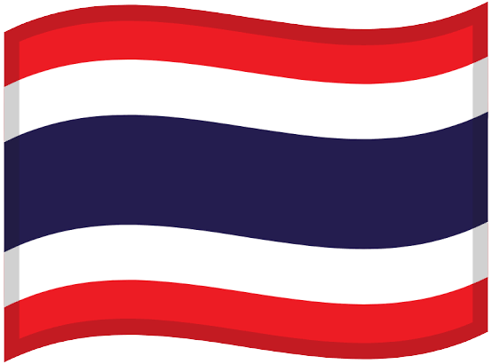

#  Hi, I'm Vichaiwat Koonsap

## 📑 Table of Contents

- [😎 About Me](#-about-me)
- [🤖 Featured Robot Projects](#-featured-robot-projects)
- [🏆 Competition Highlights](#-competition-highlights)
- [🌏 Additional Activities](#-additional-activities)
- [🎓 Education](#-education)
- [🌱 Currently Learning](#-currently-learning)

# 😎 About Me

I am a **Computer Engineering and Digital Technology (CEDT)** student at **Chulalongkorn University** with experience in robotics since 2019.

Over the years, I have developed autonomous robotic systems involving **embedded programming, computer vision, sensor integration, control systems, and mechanical design**.

I have competed in both national and international robotics competitions, including **7th place out of 60 countries at WRO Future Engineers International 2023 in Panama**, **First Runner-Up at RoboCup Singapore Soccer Open 2025**, and **First Place at TPA Robo Rescue with micro-ROS 2025**.

Beyond competitions, I served as **President of the Yothinburana Robot Club**, where I mentored junior members, prepared competition teams, and organized robotics activities and training programs.

I am currently learning beyond robotics into **software development, machine learning, and computer vision**, with the goal of developing intelligent systems that combine **software, hardware, and AI**.

---

## 🛠️ Technical Skills

### Programming

  

`C++` `Python` `Arduino`

### Robotics

`ROS 2` `micro-ROS` `ESP32` `LiDAR`  
`AMCL` `PID Control` `Autonomous Navigation`
`Embedded Systems`  
`Omnidirectional Robot Control`

### Hardware & Design

`Arduino` `ESP32` `POP-32` `Pixy2` `OpenMV`  
`Fusion 360` `3D Printing`

### Leadership & Collaboration

`Team Leadership` `Technical Mentoring`  
`Project Management` `Cross-functional Collaboration`

---

# 🤖 Featured Robot Projects

I have designed and developed robots for **autonomous navigation, robot soccer, line tracing, and competitive robotics**.

| Project | Technologies | Result |
|---|---|---|
| **TPA Robo Rescue 2025** | micro-ROS · LiDAR · AMCL · ESP32 | 🥇 1st Place |
| **RoboCup Soccer Robot 2025** | ESP32 · OpenMV · Pixy2 · PID · Omni Wheels | 🥈 1st Runner-Up |
| **WRO Future Engineers 2023 Thailand** | Arduino · Computer Vision · PID · Sensors | 🥇 1st Place |
| **WRO Future Engineers 2023 International** | Arduino · Computer Vision · PID · Sensor |  7th Place |

---

# 🏆 Competition Highlights

| Competition | Result | Main Focus |
|---|---:|---|
| [**TPA Robo Rescue with micro-ROS 2025**](competitions/roborescue.md) | 🥇 1st Place | micro-ROS · LiDAR · AMCL |
| [**WRO Future Engineers International 2023**](competitions/wroin2023.md) | **7th / 60 Countries** | Autonomous Navigation |
| [**WRO Future Engineers Thailand 2023**](competitions/wroth2023.md) | 🥇 1st Place | Autonomous Navigation |
| [**RoboCup Singapore Soccer Open 2025**](competitions/robocup.md) | 🥈 1st Runner-Up | Computer Vision · Omni Drive |
| [**WRG Soccer Robot 1v1**](competitions/wrg.md) | 4th Place | Computer Vision · Omni Drive |
| [**WRO Future Engineers Thailand 2024**](competitions/fe2024.md) | 4th Place | Autonomous Navigation |
| [**46 ICT Fast Line Tracing**](competitions/46ict.md) | 🥇 Gold Medal | PID · Embedded Systems |
| [**Silapa 71 Intermediate Robotics**](competitions/silapa.md) | 🥇 Gold Medal | Maze Solving |
| [**LEGO Robot Battle**](competitions/lego.md) | 🥈 First Runner-Up | Mechanical Design |
| [**PIM Robotics Playground Line Tracing**](competitions/pim.md) | Participation | PID · 3D Design |

> **→ Click any competition to explore its detailed case study, including the robot, technical challenges, development process, and competition performance.**

---

# 🌏 Additional Activities

| Activity | Type | Focus |
|---|---|---|
| [**President — Yothinburana Robot Club**](activities/yothinburana-robot-club.md) | Leadership | Team Leadership · Mentoring · Robotics |
| [**NECTEC Smart Summer Internship**](competitions/nectec.md) | Excellent | Computer Vision · Internship · Real-World Working |
| [**Harbin Engineering University — AI Training Camp**](activities/harbin-ai-training-camp.md) | Study Abroad | Artificial Intelligence · Academic Experience |
| [**TPA Robo Rescue 2024 Qualification**](activities/tpa-robo-rescue-2024.md) | Competition Qualification | Robotics · Autonomous Systems |
| [**YB Robot Starter Camp**](activities/yb-robot-starter-camp.md) | Mentoring | Robotics · Programming · Education |
| [**YB Robot Open House**](activities/yb-robot-open-house.md) | Outreach | Robotics · Communication · Community |
| [**Thailand's National Outstanding Youth Award**](activities/national-outstanding-youth-award.md) | Award | National Recognition · International Representation |
| [**Honorary Award for Exemplary Yothinburana Student**](activities/exemplary-yothinburana-student-award.md) | Award | School Contribution · Recognition |

> **→ Click any activity to view its detailed experience, responsibilities, and highlights.**

# 🎓 Education

### Chulalongkorn University
**Computer Engineering and Digital Technology (CEDT)**  
Currently First Year

### Yothinburana School
**Regular Program**  
Y7–Y12

### Chonprathan Wittaya School
**English Program**  
Y1–Y6

---

# 🌱 Currently Learning

I am currently focusing on expanding my knowledge in:

- Machine Learning
- Computer Vision
- Software Development
- Data Structures & Algorithms
- Artificial Intelligence
- Advanced Python

My long-term goal is to combine these areas with my robotics background to develop **intelligent autonomous systems**.

