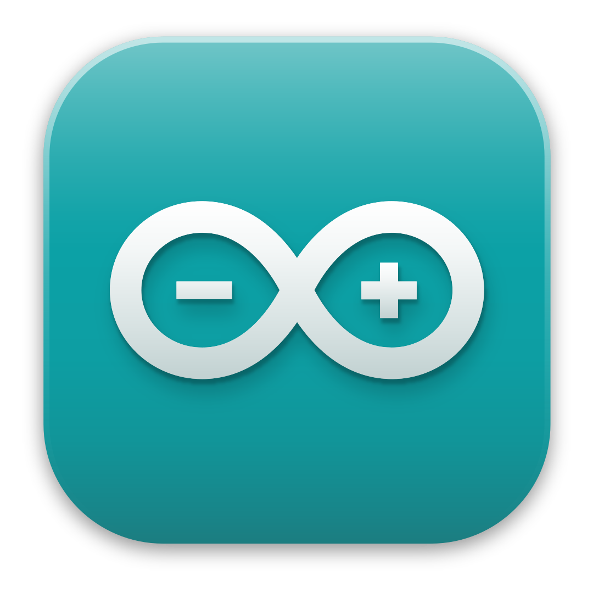
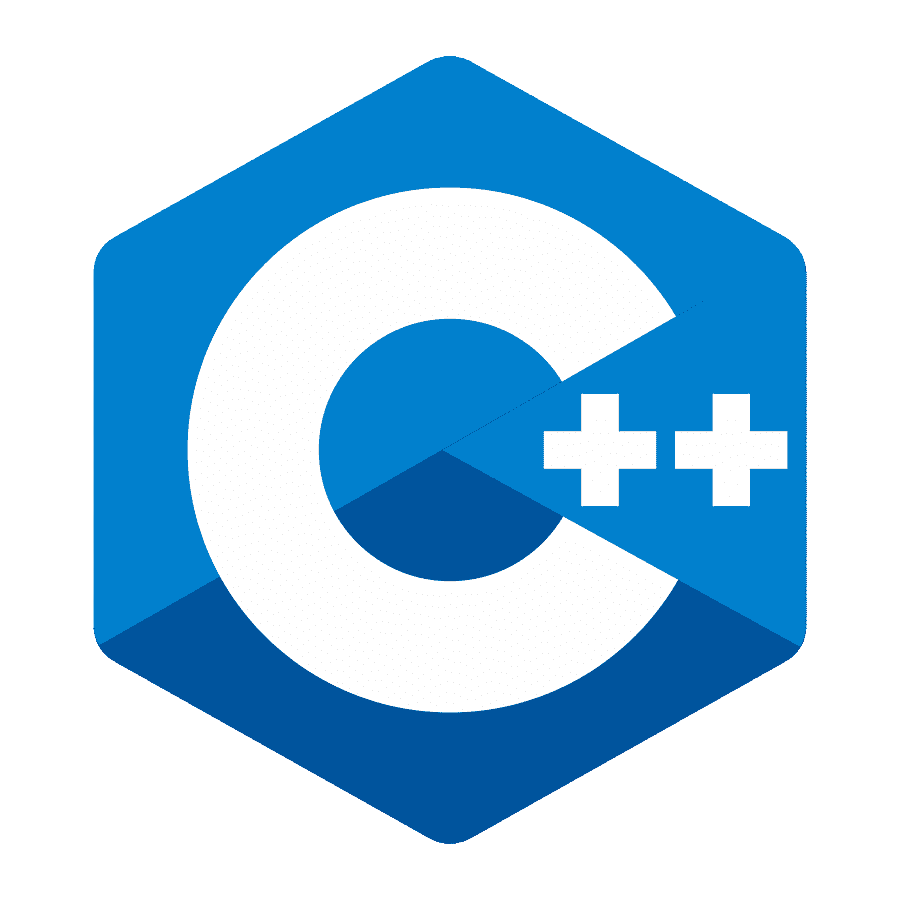
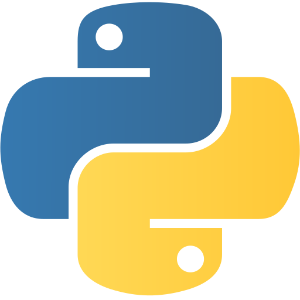

#  Hi, I'm Vichaiwat Koonsap

### Computer Engineering & Digital Technology Student | Robotics | Computer Vision | AI

I am a **Computer Engineering and Digital Technology (CEDT)** student at **Chulalongkorn University** with experience in robotics since 2019.

Over the years, I have developed autonomous robotic systems involving **embedded programming, computer vision, sensor integration, control systems, and mechanical design**.

I have competed in both national and international robotics competitions, including **7th place out of 60 countries at WRO Future Engineers International 2023 in Panama**, **First Runner-Up at RoboCup Singapore Soccer Open 2025**, and **First Place at TPA Robo Rescue with micro-ROS 2025**.

Beyond competitions, I served as **President of the Yothinburana Robot Club**, where I mentored junior members, prepared competition teams, and organized robotics activities and training programs.

I am currently expanding my knowledge beyond robotics into **software development, machine learning, and computer vision**, with the goal of developing intelligent systems that combine **software, hardware, and AI**.

---

# 🛠️ Technical Skills

### Programming

  

`C++` `Python` `Arduino`

### Robotics

`ROS 2` `micro-ROS` `ESP32` `LiDAR`  
`AMCL` `PID Control` `Sensor Fusion`  
`Autonomous Navigation` `Embedded Systems`  
`Omnidirectional Robot Control`

### Computer Vision & AI

`OpenCV` `YOLO` `MediaPipe`  
`Object Detection` `Object Tracking`  
`Image Processing` `Camera-based Robot Control`

### Hardware & Design


`Arduino` `ESP32` `POP-32` `Pixy2` `OpenMV`  
`Fusion 360` `3D Printing`

### Leadership & Collaboration

`Team Leadership` `Technical Mentoring`  
`Project Management` `Cross-functional Collaboration`

---

# 🤖 Featured Robot Projects

I have designed and developed robots for **autonomous navigation, robot soccer, line tracing, and competitive robotics**.

| Project | Technologies | Result |
|---|---|---|
| **TPA Robo Rescue 2025** | micro-ROS · LiDAR · AMCL · ESP32 | 🥇 1st Place |
| **RoboCup Soccer Robot 2025** | ESP32 · OpenMV · Pixy2 · PID · Omni Wheels | 🥈 1st Runner-Up |
| **WRO Future Engineers 2023** | Arduino · Computer Vision · PID · Sensors | 🥇 1st Place |
| **WRG Soccer Robot** | Computer Vision · Omni Wheels · Fusion 360 | 4th Place |

### 🔧 Robot Design Gallery

I keep detailed robot designs and technical documentation on separate pages to keep this README clean.

- **[Robot Project 1](projects/robot-project-1.md)** — Autonomous robot design and technical development
- **[Robot Project 2](projects/robot-project-2.md)** — Omnidirectional soccer robot with computer vision
- **[Robot Project 3](projects/robot-project-3.md)** — Autonomous navigation robot using LiDAR and micro-ROS

**→ [View All Robot Projects](projects/)**

---

# 🏆 Competition Highlights

## 🏆 Competition Highlights

| Competition | Result | Main Focus |
|---|---:|---|
| [**TPA Robo Rescue with micro-ROS 2025**](competitions/roborescue.md) | 🥇 1st Place | micro-ROS · LiDAR · AMCL |
| [**WRO Future Engineers International 2023**](competitions/wroin2023.md) | **7th / 60 Countries** | Autonomous Navigation |
| [**WRO Future Engineers Thailand 2023**](competitions/wroth2023.md) | 🥇 1st Place | Autonomous Navigation |
| [**RoboCup Singapore Soccer Open 2025**](competitions/robocup.md) | 🥈 1st Runner-Up | Computer Vision · Omni Drive |
| [**WRG Soccer Robot 1v1**](competitions/wrg.md) | 4th Place | Computer Vision · Omni Drive |
| [**WRO Future Engineers Thailand 2024**](competitions/fe2024.md) | 4th Place | Autonomous Navigation |
| [**46 ICT Fast Line Tracing**](competitions/46ict.md) | 🥇 Gold Medal | PID · Embedded Systems |
| [**Silapa 71 Intermediate Robotics**](competitions/silapa.md) | 🥇 Gold Medal | Maze Solving |
| [**LEGO Robot Battle**](competitions/lego.md) | 🥈 First Runner-Up | Mechanical Design |
| [**PIM Robotics Playground Line Tracing**](competitions/pim.md) | Participation | PID · 3D Design |
| [**NECTEC Smart Summer Internship**](competitions/nectec.md) | Excellent | Computer Vision |

> **→ Click any competition to view its detailed case study, including the robot design, technologies, technical challenges, development process, competition performance, and lessons learned.**

# 💼 Experience & Leadership

## President — Yothinburana Robot Club

I served as President of the **Yothinburana Robot Club**, where I was responsible for leading members and preparing teams for robotics competitions.

My responsibilities included:

- Mentoring junior members
- Teaching robotics and programming
- Preparing competition teams
- Managing technical development
- Organizing club activities
- Selecting new members
- Coordinating senior members and competition teams

I also helped members apply technical knowledge and competition experience developed by previous generations of the club.

Through this role, I developed strong skills in:

`Team Leadership` · `Technical Mentoring` · `Project Management` · `Communication` · `Team Collaboration`

---

# 🌏 Additional Experiences

## Harbin Engineering University — AI Training Camp

**March 27 – April 24, 2024**

Participated in a one-month study abroad program focused on **Artificial Intelligence**.

Studied fundamental AI concepts and logical reasoning while visiting research laboratories and experiencing an academic research environment.

---

## TPA Robo Rescue 2024 Qualification

Completed the online qualification examination required to participate in the TPA Robo Rescue competition.

---

## YB Robot Starter Camp

Helped plan, manage, and oversee the Yothinburana Robot Club's annual robotics camp.

The program introduced students to:

- Logical thinking
- Mechanical assembly
- Programming
- Fundamental robotics

---

## YB Robot Open House

Hosted a robotics club booth during the Yothinburana Open House to introduce students to robotics and the YB Robot Club.

---

# 🎓 Education

### Chulalongkorn University
**Computer Engineering and Digital Technology (CEDT)**  
Currently First Year

### Yothinburana School
**Regular Program**  
Y7–Y12

### Chonprathan Wittaya School
**English Program**  
Y1–Y6

---

# 🌱 Currently Learning

I am currently focusing on expanding my knowledge in:

- Machine Learning
- Computer Vision
- Software Development
- Data Structures & Algorithms
- Artificial Intelligence
- Advanced Python

My long-term goal is to combine these areas with my robotics background to develop **intelligent autonomous systems**.

---

# 🏅 Awards

### Thailand's National Outstanding Youth Award

Presented to youths representing Thailand in international events.

### Honorary Award for Exemplary Yothinburana Student

Presented to students who contributed to and enhanced the reputation of Yothinburana School.

---

# 📂 Portfolio Structure

I keep the main README focused on the most important parts of my experience.

Detailed technical documentation, robot designs, competition photos, certificates, and additional materials are organized into separate pages.

```text
/
├── README.md
│
├── projects/
│   ├── robot-project-1.md
│   ├── robot-project-2.md
│   └── robot-project-3.md
│
├── competitions/
│   ├── tpa-robo-rescue-2025.md
│   ├── robocup-singapore-2025.md
│   ├── wro-panama-2023.md
│   ├── wro-thailand-2023.md
│   ├── wrg-soccer-1v1.md
│   └── ...
│
├── gallery/
│   ├── tpa-robo-rescue-2025.md
│   ├── robocup-singapore-2025.md
│   ├── wro-panama-2023.md
│   └── ...
│
├── experience/
│   └── nectec-internship.md
│
└── resources/
    ├── Arduino.png
    ├── cplusplus.png
    ├── python.png
    ├── fusion.png
    └── thaiflag.png
